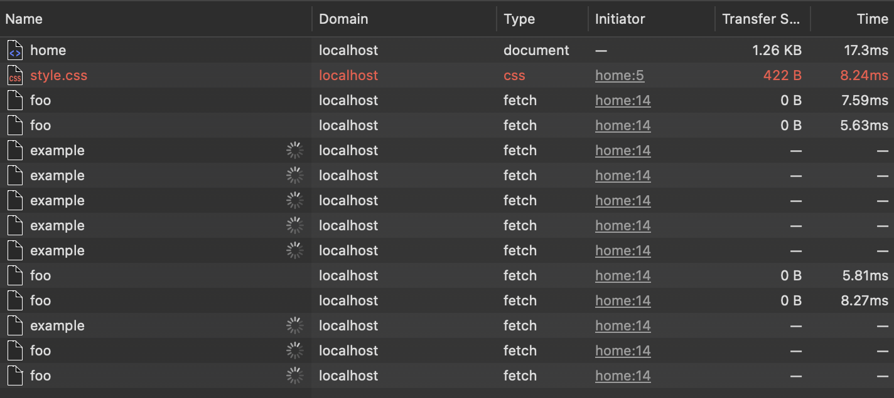

# Browser connection limitations

Browsers limit the number of HTTP connections with the same domain name. This restriction is defined in the HTTP specification (RFC2616). Most modern browsers allow six connections per domain. Most older browsers allow only two connections per domain.

## Example

In the example, you can make calls to "/foo" without any issues, but if we execute calls to "/example," which is an endpoint that never responds, and the client's calls are made without a timeout, once we reach the defined threshold of up to 6 requests, the subsequent calls won't be able to execute. In other words, we exhaust the connection pool allowed by the browser for this particular domain, leading to a resource leak. It is essential to be cautious about this situation.

As we can see in the example, the last calls to "/foo" no longer work because there are no more connections available in the pool due to the resource leak.